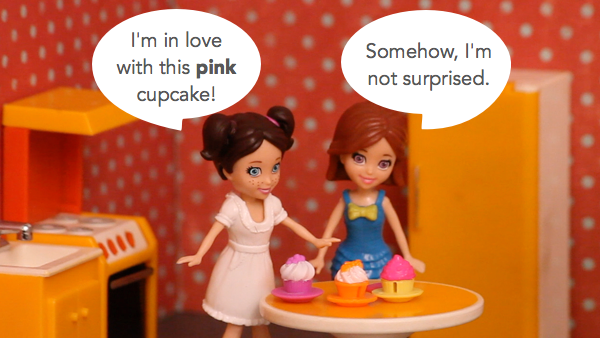

<!-- import Highlight from '@site/src/components/Highlight'; -->

<!-- <Highlight color='#800031' highlight='fg' fontWeight='bold'> ECMA International</Highlight>  -->

### Pattern Mapping

:::tip
* **Pa** in Tamil is equivalent to **Ha** in Kannada [Eg: *Paal - Haalu, Pasi - Hasivu*] and so **Pu** to **Hu** [Eg: *Puli - Huli*], **Pe** to **He** [Eg: *Pen (பெண்) - Hennu*]
* **Vaa** in Tamil is equivalent to **Baa** in Kannada [Eg: *Vaai - Baai*] and so **Ve** to **Be** [Eg: *Venum - Beku, Vendam - Beda, Velli - Belli*], **Vi** to **Bi** [Eg: *Vidu - Bidu*]
* The verbs ending with suffix **nga** (to convey respect) in Tamil is equivalent to **i/li** in Kannada, depending on the verb. [Eg: *Sollunga - Heli, Utkarunga - Kuthkoli, Paarunga - Nodi*]
* The nouns ending with **am** in Tamil is equivalent to **aa** in Kannada. [Eg: *Artham - Arthaa, Samacharam - Samacharaa, Vishesam - Vishesaa, Paanakkam (பானகம்) - Paanakka, Varusham - Varushaa*]
:::

<!--truncate-->

### Greetings

| **Tamil**        | **Kannada**     | **தமிழ்**     | **ಕನ್ನಡ**    |
|------------------|-----------------|----------------|--------------|
| Varaverpu        | Swagatha        | Vanakkam       | Namaskāra    |
| Kaalai Vanakkam  | Shubha mun̄jāne  | Malai Vankkam  | Shubha san̄je |
| Madhiya Vanakkam | Shubha madhyāna | Iravu Vanakkam | Shubha rātri |
| Nantri           | Dhan'yavātagaḷu |                |              |

### Family

| **Tamil** |     **Kannada** |**தமிழ்** | **ಕನ್ನಡ** |
|-----------|-----------------|-----------|-----------|
| Amma      | Amma            | Anna      | Anna      |
| Appa      | Appa            | Thambi    | Tam'ma    |
| Akka      | Akka            | Thangai   | Thangi    |
| Periyappa | Dhodappa        | Chittappa | Chikkappa |
| Periyamma | Dhodamma        | Chitti    | Chikkamma |
| Maama     | Maava           | Athai     | Atthe     |

### Number

| **Tamizh** | **Kannada**     | **தமிழ்**| **ಕನ್ನಡ**   | **Tamil** | **கன்னடா**   |
|------------|-----------------|-----------|-------------|-----------|------------------|
| 0          | Sonne           | 1,000     | sāvira      | 10,000    | hatthu   saavira |
| 1          | ondu            | 11        | hannondu    | 21        | ippattondu       |
| 2          | yeradu          | 12        | hanneradu   | 22        | ippatteradu      |
| 3          | mooru           | 13        | hadimooru   | 30        | moovatthu        |
| 4          | naalku          | 14        | hadinalku   | 40        | nala'vattu       |
| 5          | aidu            | 15        | hadinaidu   | 50        | aivatthu         |
| 6          | aaru            | 16        | hadinaaru   | 60        | aravatthu        |
| 7          | aelu            | 17        | hadinelu    | 70        | ep'pattu         |
| 8          | entu            | 18        | hadinentu   | 80        | embatthu         |
| 9          | ombatthu        | 19        | hathombattu | 90        | thombatthu       |
| 10         | hatthu          | 20        | ippatthu    | 100       | nooru            |
| 1,00,000   | laksha          | 10,00,000 | hattulaksha | kōdi      | kōṭi(kōdi)       |

### Season

| **Tamizh**                            | **Kannada**        | **தமிழ்**                        | **ಕನ್ನಡ**             |
|---------------------------------------|--------------------|-----------------------------------|------------------------|
| Dhinam                                | Dhinaa             | Maasam                            | Maasa                  |
| Varusham                              | Varushaa           | Innaiku                           | Ivathu                 |
| Nethu  (Yesterday)             | Ninne              | Naalaiku  (Tomorrow)        | Naale                 |
| Mundhaanaal  (Day before yesterday) | Monne              | Naalanaal  (Day after tomorrow) | Naalithu  (Naaliddu) |

### Interrogatives

| **English** | **Tamizh** | **Kannada**     |
|-------------|------------|-----------------|
| What        | Yenna      | Yean'uu (Ēnu)   |
| Why         | yean       | Yaake           |
| When        | Eppo       | yawaga          |
| Where       | Enga       | Elli            |
| Who         | Yaar       | Yaaru           |
| How         | Eppidi     | Hege            |

### Subjective Pronouns

| **English** | **Tamizh**   |     **Kannada** |
|-------------|--------------|-----------------|
| I           | Naan         | Naanu           |
| We          | Naanga       | Naavu           |
| You         | Nee / Neenga | Neenu / Neevu   |
| He          | Avan         | Avanu / Avaru   |
| She         | Aval         | Avalu / Avaru   |
| This        | Adhu         | Adhu            |
| That        | Idhu         | Idhu            |

### Possessive Pronouns

| **English** | **Tamizh**         | **Kannada**                      |
|-------------|--------------------|----------------------------------|
| Mine        | Enadhu             | Nan'nadhu                        |
| Ours        | Namadhu            | Nam'madhu                        |
| Yours       | Unadhu / Ungaladhu | Nin'nadhu / Nim'madhu (Tam'madu) |
| His         | Avanadhu           | Avandhu / Avardhu                |
| Hers        | Avaladhu           | Avaldhu / Avardhu                |

### Nouns

|       | **English** | **Tamizh** | **Kannada** |        | **English** |   **தமிழ்**  | **ಕನ್ನಡ** |
|-------|:-----------:|:----------:|:-----------:|:------:|:-----------:|:-----------:|:--------:|
| **1** | Breakfast   | Saapadu    | Thindi      | **9**  | Leg         | Kaal        | Kaalu    |
| **2** | Lunch       | Saapadu    | Oota        | **10** | Nose        | Mooku       | Moogu    |
| **3** | Dinner      | Saapadu    | Oota        | **11** | Truth       | Unmai/Nijam | Nijaa    |
| **4** | Hunger      | Pasi       | Hasivu      | **12** | Lie         | Poi         | Sullu    |
| **5** | Water       | Thanni     | Neeru       | **13** | Yes         | Aama        | Houdhu   |
| **6** | Milk        | Paal       | Haalu       | **14** | No          | Illa        | Illa     |
| **7** | Vehicle     | Vandi      | Gaadi       | **15** | Boy         | Payan       | Huduga   |
| **8** | Hand        | Kai        | Kai         | **16** | Girl        | Ponnu       | Hudugi   |

### Verbs

|        | **English** |     **Tamizh**     |      **Kannada**      |        | **English** |       **தமிழ்**       |        **ಕನ್ನಡ**       |
|--------|:-----------:|:------------------:|:---------------------:|:------:|:-----------:|:--------------------:|:---------------------:|
| **1**  | Is          | Iruku              | Idhe                  | **11** | Read        | Padi                 | Odhu                  |
| **2**  | Know        | Theriyum           | Gothu                 | **12** | See         | Paaru/Paarunga       | Nodu/Nodi             |
| **3**  | Don't know  | Theiyadhu          | Gothilla              | **13** | Take        | Edu/  Eduthukonga  | Tago/  Tagoli       |
| **4**  | Want        | Venum              | Beku                  | **14** | Keep        | Vai/Vainga           | Irisiko/  Irisikoli |
| **5**  | Don't want  | Vendam             | Beda                  | **15** | Put         | Podu/Podunga         | Haaku/Haaki           |
| **6**  | Tell        | Sollu/  Sollunga | Helu/Heli             | **16** | Stop        | Nil                  | Nillu                 |
| **7**  | Speak       | Pesu/  Pesunga   | Maathadu/  Maathadi | **17** | Give        | Kodu/Kodunga         | Kodu/Kodi             |
| **8**  | Come        | Vaa/  Vaanga     | Baa/  Banni/Banri   | **18** | Sit         | Utkaru/  Utkarunga | Kuthko/  Kuthkoli   |
| **9**  | Go          | Po/Ponga           | Hogu/Hogi             | **19** |             |                      |                       |
| **10** | Listen      | Kelu/  Kelunga   | Kelu/Keli             | **20** |             |                      |                       |

### Preposition

### Adjectives and adverbs
An adjective is a word that **describes a noun**. In other words, it tells us more about a particular person, place, or thing.

An adverb is a word that **describes a verb**. Just like adjectives, adverbs are used to add detail to a sentence. More specifically, adverbs tell us **how**, **when**, or **where** something happened.

### Resources

1. [What are the simple shortcuts to learn a passable Kannada for a Tamil speaker?](https://www.quora.com/What-are-the-simple-shortcuts-to-learn-a-passable-Kannada-for-a-Tamil-speaker)
