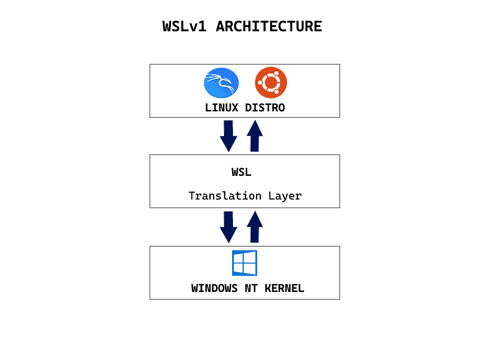

<!-- import Highlight from '@site/src/components/Highlight'; -->

<!-- <Highlight color='#800031' highlight='fg' fontWeight='bold'> ECMA International</Highlight>  -->

## WSL

### Install WSL

Open PowerShell or Windows Command Prompt in **administrator** mode by right-clicking and selecting "Run as administrator", enter the `wsl --install` command, then restart your machine. This command only works if WSL is not installed at all.

<!--truncate-->




### Change the default Linux distribution installed

1. To install additional distributions, enter: `wsl --install -d <Distribution Name>`. Replace `<Distribution Name>` with the name of the distribution you would like to install.
2. To see a list of available Linux distributions available for download through the online store, enter: `wsl --list --online` or `wsl -l -o`.
3. If you want to install additional distributions **from inside a Linux/Bash** command line (rather than from PowerShell or Command Prompt), you must use `.exe` in the command: `wsl.exe --install -d <Distribution Name>` or to list available distributions: `wsl.exe -l -o`.
4. To install a Linux distribution that is not listed as available, you can download from microsoft store. Or you can [import any Linux distribution](https://learn.microsoft.com/en-us/windows/wsl/use-custom-distro) using a TAR file. Or in some cases, [as with Arch Linux](https://wsldl-pg.github.io/ArchW-docs/How-to-Setup/), you can install using an `.appx` file. You can also create your own [custom Linux distribution](https://learn.microsoft.com/en-us/windows/wsl/build-custom-distro) to use with WSL.


* [Helper article](https://www.partitionwizard.com/partitionmagic/wsl-not-working-in-windows-11.html), Before proceeding with wsl installation
* If you run into an issue during the install process, check the [installation section of the troubleshooting guide](https://learn.microsoft.com/en-us/windows/wsl/troubleshooting#installation-issues).
* If you are on earlier versions please see [the manual install page](https://learn.microsoft.com/en-us/windows/wsl/install-manual).


### wsl1 and wsl2

1. To see whether your Linux distribution is set to **WSL 1** or **WSL 2**, use the command: `wsl -l -v`.
2. To change versions, use the command: `wsl --set-version <distro name> 2` replacing `<distro name>` with the name of the Linux distribution that you want to update. If you want to change to 1, replace 2 by 1.
3. To set the default Linux distribution used with the wsl command, enter: `wsl -s <DistributionName>` or `wsl --set-default <DistributionName>`, replacing `<DistributionName>` with the name of the Linux distribution you would like to use.
4. For more basic commands for WSL, [you can visit](https://learn.microsoft.com/en-us/windows/wsl/basic-commands)

### Checking Ubuntu Version

1. `lsb_release` Command to Show Ubuntu Versio - Linux Standard Base(LSB)
    - `lsb_release -a` (all), `lsb_release -d` (description), `lsb_release -dc`
2. `cat /etc/lsb-release` is another way
3. `cat /etc/*release` to print full lineup
4. `cat /etc/os-release` to display the contents of the os-release file
5. `hostnamectl` to show the host machine’s details
6. When you connect to a remote machine via SSH, the remote system often prints a message that’s stored in the /etc/issue file. If you have access to the machine, you can display the contents of this file to get the Ubuntu version
    - `cat /etc/issue` and `cat /etc/issue.net`
7. screenfetch is a very interesting script that displays system information in the terminal. It’s popular because of the concise information output and a great-looking ASCII image.
    ```bash
    sudo apt install screenfetch -y
    screenfetch
    ```
8. neofetch is a more modern version of the screenfetch Bash script. In addition to showing system information, it also displays a color palette underneath the itemized list.
    ```sh
    sudo apt install neofetch -y
    neofetch
    ```

<!-- ### Setting up nodejs with nvm on WSL


## Miniconda

## SSH key in github

## ubuntu remote login website and other through putty -->