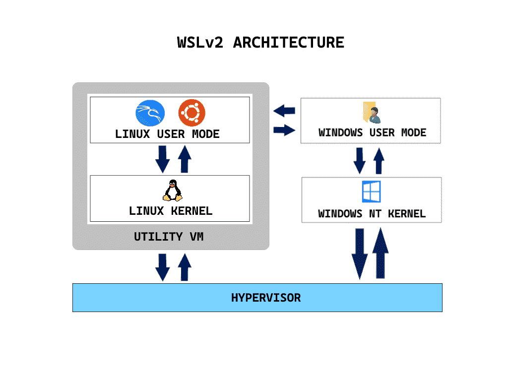
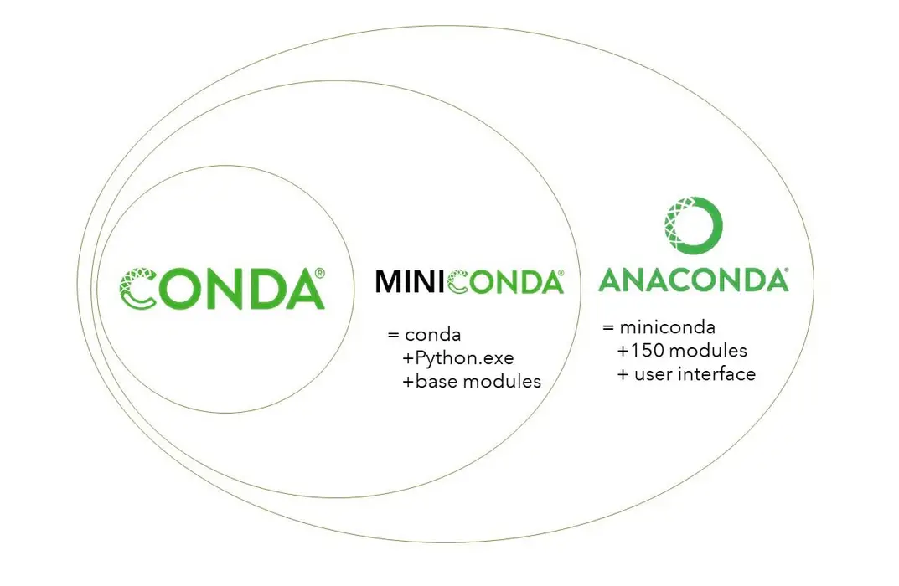

<!-- import Highlight from '@site/src/components/Highlight'; -->

<!-- <Highlight color='#800031' highlight='fg' fontWeight='bold'> ECMA International</Highlight>  -->

## WSL

### Install WSL

Open PowerShell or Windows Command Prompt in **administrator** mode by right-clicking and selecting "Run as administrator", enter the `wsl --install` command, then restart your machine. This command only works if WSL is not installed at all.

<!--truncate-->




### Change the default Linux distribution installed

1. To install additional distributions, enter: `wsl --install -d <Distribution Name>`. Replace `<Distribution Name>` with the name of the distribution you would like to install.
2. To see a list of available Linux distributions available for download through the online store, enter: `wsl --list --online` or `wsl -l -o`.
3. If you want to install additional distributions **from inside a Linux/Bash** command line (rather than from PowerShell or Command Prompt), you must use `.exe` in the command: `wsl.exe --install -d <Distribution Name>` or to list available distributions: `wsl.exe -l -o`.
4. To install a Linux distribution that is not listed as available, you can download from microsoft store. Or you can [import any Linux distribution](https://learn.microsoft.com/en-us/windows/wsl/use-custom-distro) using a TAR file. Or in some cases, [as with Arch Linux](https://wsldl-pg.github.io/ArchW-docs/How-to-Setup/), you can install using an `.appx` file. You can also create your own [custom Linux distribution](https://learn.microsoft.com/en-us/windows/wsl/build-custom-distro) to use with WSL.


* [Helper article](https://www.partitionwizard.com/partitionmagic/wsl-not-working-in-windows-11.html), Before proceeding with wsl installation
* If you run into an issue during the install process, check the [installation section of the troubleshooting guide](https://learn.microsoft.com/en-us/windows/wsl/troubleshooting#installation-issues).
* If you are on earlier versions please see [the manual install page](https://learn.microsoft.com/en-us/windows/wsl/install-manual).


### wsl1 and wsl2
Fire the below commands in Powershell

1. To see whether your Linux distribution is set to **WSL 1** or **WSL 2**, use the command: `wsl -l -v`.
2. To change versions, use the command: `wsl --set-version <distro name> 2` replacing `<distro name>` with the name of the Linux distribution that you want to update. If you want to change to 1, replace 2 by 1.
3. To set the default Linux distribution used with the wsl command, enter: `wsl -s <DistributionName>` or `wsl --set-default <DistributionName>`, replacing `<DistributionName>` with the name of the Linux distribution you would like to use.
4. For more basic commands for WSL, [you can visit](https://learn.microsoft.com/en-us/windows/wsl/basic-commands)

### Checking Ubuntu Version 
Fire the below commands in ubuntu (WSL)

1. `lsb_release` Command to Show Ubuntu Versio - Linux Standard Base(LSB)
    - `lsb_release -a` (all), `lsb_release -d` (description), `lsb_release -dc`
2. `cat /etc/lsb-release` is another way
3. `cat /etc/*release` to print full lineup
4. `cat /etc/os-release` to display the contents of the os-release file
5. `hostnamectl` to show the host machine’s details
6. When you connect to a remote machine via SSH, the remote system often prints a message that’s stored in the /etc/issue file. If you have access to the machine, you can display the contents of this file to get the Ubuntu version
    - `cat /etc/issue` and `cat /etc/issue.net`
7. screenfetch is a very interesting script that displays system information in the terminal. It’s popular because of the concise information output and a great-looking ASCII image.
    ```bash
    sudo apt install screenfetch -y
    screenfetch
    ```
8. neofetch is a more modern version of the screenfetch Bash script. In addition to showing system information, it also displays a color palette underneath the itemized list.
    ```sh
    sudo apt install neofetch -y
    neofetch
    ```

### Setting up nodejs with nvm on WSL

Install NVM via bash shell (WSL) as below:

```sh
curl -o- https://raw.githubusercontent.com/nvm-sh/nvm/v0.39.7/install.sh | bash
```

```sh
wget -qO- https://raw.githubusercontent.com/nvm-sh/nvm/v0.39.7/install.sh | bash
```

( Note: instead of v0.38.0 Use the [latest version of nvm from GitHub](https://github.com/nvm-sh/nvm))

Verify your installation using

```bash
command -v nvm
```

* `nvm install --lts` to install the latest LTS, `nvm install node` to install the latest version
* `nvm ls` or `nvm list` to check all the installed node versions
* `nvm install 12.18.3` or `nvm install 20` to install particular versions
* `nvm use 20` to change to node version 20
* `nvm ls-remote` to list available versions online to be installed

- Set default node version
```bash
nvm alias default node # this refers to the latest installed version of node
nvm alias default 18 # this refers to the latest installed v18.x version of node
nvm alias default 18.12  # this refers to the latest installed v18.12.x version of node
```

For more help related to [nvm](https://github.com/nvm-sh/nvm#readme) 

Then we can use node as normally as below:

* `npm install --global yarn` or `npm i -g yarn` to install yarn globally
* `npm install -g @angular/cli` to install Angular CLI globally
* `npm install <package-name> --save-dev` or `npm i -D <package-name>`, `yarn add <package-name> –dev` or `yarn add -D <package-name>` to install package under devDependencies
* `npm install` or `npm i` or `yarn install` or `yarn ` to install all dependencies present in `package.json`
* consider the below`package.json`.

```json
{
  "name": "wiki",
  "version": "0.0.0",
  "scripts": {
    "docusaurus": "docusaurus",
    "start": "docusaurus start",
    "serve": "docusaurus serve",
  }
}
```
    - `npm run serve` or `yarn serve` or `yarn run serve` to execute `serve` command present inside the file. Other commands also follow the same way.

## Miniconda

Some of the popular virtual environment implementations for Python are:
    - [Virtualenv](https://www.youtube.com/watch?v=N5vscPTWKOk), [Conda](https://www.anaconda.com/), [pipenv](https://pipenv.pypa.io/en/latest/), [venv](https://docs.python.org/3/library/venv.html) and several others exist. However the most popular ones are Conda, Pipenv and venv as well. Specifically, Conda is popular amongst Data Scientists whereas pipenv is popular amongst software engineers.
    - Conda is a package manager and a virtual environment and it provides the convenience of allowing you to manage what version of Python the virtual environment (and as a result your project) uses as well. So naturally, conda is very convenient and I use it my projects as well.



### Install miniconda

1. Download Miniconda Installer
```sh
wget https://repo.anaconda.com/miniconda/Miniconda3-latest-Linux-x86_64.sh -O /opt/miniconda-installer.sh
```

```bash
sudo wget https://repo.anaconda.com/miniconda/Miniconda3-latest-Linux-x86_64.sh -O /opt/miniconda-installer.sh
```
The Miniconda installer script has been downloaded and saved as `miniconda-installer.sh` at the location `/opt`

2. Install Miniconda

```sh
bash /opt/miniconda-installer.sh
```

Follow the instructions shown on the screen. We need to press **ENTER** to review the license agreement. Keep pressing **ENTER** or **SPACE** to finish it. , At the end of the agreement, you will be asked to accept the license terms or not. Type **yes** to accept and continue. And continue till you see ***Thank you for installing Miniconda3!***

3. Configure Miniconda

After the Miniconda installation, we need to apply the changes made to `~/.bashrc` file. Miniconda installer modified the file during the installation. Let’s execute the command.

```sh
source ~/.bashrc
```

Now, at this point, you can run this command to check your Miniconda information.

```sh
conda info
```

* `conda install package-name` to install a Python package. So, if you want to install pandas, you can run `conta install pandas`
* to exit from the conda environment, `conda deactivate`

### Create conda environment
Conda centrally manages the environments you create, so, you don’t have to bother about creating a folder for specific environments yourself. You can either start by creating an empty environment or mention the python version and packages you need at the time of creation itself.

* Create an empty environment

```sh
conda create --name {env_name}
conda create --name myenv
```

* Create an environment + specific python version

```sh
conda create --name {env_name} {python==3.7.5}
conda create --name myenv python==3.7.5
```

This will also install packages like `pip`, `wheel`, `setuptools`. You can then activate the environment (see below) and

* Create an environment + specific Python version + packages

```sh
conda create --name env_name python==3.7.5 package_name1 package_name2
```

example
```sh
conda create --name myenv python==3.7.5 pandas numpy
```

### Activate the environment

```sh
conda activate {env_name}
```

To deactivate whichever you are currently in, use:

```sh
conda deactivate
```

### Install more packages

Once activated you can install more packages using either `conda` or with `pip`.

With Conda
```sh
conda install pkg_name1==1.x.y pkg_name2==1.x.y
```

With pip
```sh
pip install pkg_name2==1.x.y pkg_name2==1.x.y
```

or install multiple packages from `requirements.txt`.
```sh
pip install -r requirements.txt
```

### Check the list of packages and environments

* See list of environments
```sh
conda env list
# or
conda info --envs
```

* Show list of packages in current environment

```sh
conda list
```

* See list of packages in specific environment

```sh
conda list -n myenv
```

* Rename an existing environment

```sh
conda rename -n old_env new_env
```

### Change 'base' environment permanently to a different environment 'myenv' at startup

```sh
conda activate myenv
echo "conda activate myenv" >> ~/.bashrc
```

## SSH key in github

## ubuntu remote login website and other through 

### Resources

1. [Anaconda change 'base' environment permanently to a different environment 'myenv' to startup at terminal openings](https://askubuntu.com/questions/1335235/anaconda-change-base-environment-permanently-to-a-different-environment-myenv)
2. 